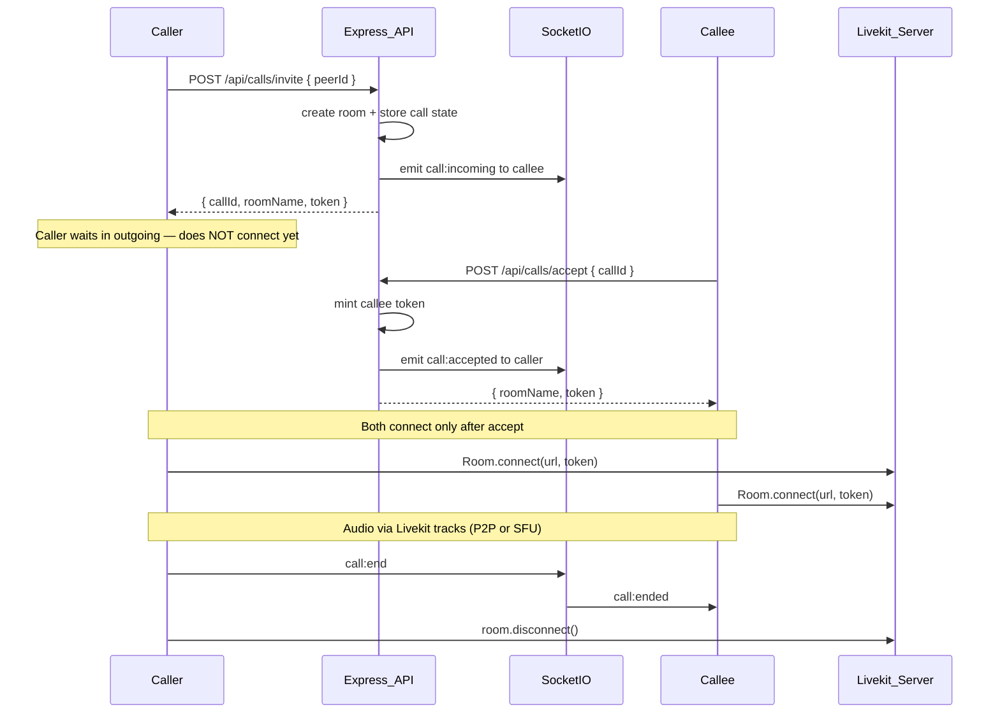

# WebRTC Audio Calls with Livekit

## Library choice: Livekit

**Recommended stack:**


| Package                                                                        | Where               | Role                                                         |
| ------------------------------------------------------------------------------ | ------------------- | ------------------------------------------------------------ |
| `[livekit-server-sdk](https://docs.livekit.io/home/server/generating-tokens/)` | Backend             | Create rooms, mint JWT access tokens                         |
| `[livekit-client](https://docs.livekit.io/home/client/connect/)`               | Frontend            | Connect to room, publish/subscribe audio (and video later)   |
| `[@livekit/components-react](https://docs.livekit.io/home/client/react/)`      | Frontend (optional) | Pre-built audio/video UI primitives for faster video rollout |


### Why Livekit fits YNA_Chat

Your app is a **1:1 Clerk-authenticated chat** on a **Render monolith** (`[Dockerfile](Dockerfile)` — single Express container). You want a **real library** (not raw `RTCPeerConnection`) and **video calls later**.


| Option                 | Verdict                                                                                  |
| ---------------------- | ---------------------------------------------------------------------------------------- |
| Native WebRTC          | Rejected — you asked for a library                                                       |
| `simple-peer` / PeerJS | Thin P2P wrappers; 1:1 video works, but **group video requires a full rewrite**          |
| mediasoup              | Powerful SFU, but low-level — you'd rebuild what Livekit already provides                |
| Daily.co / Agora       | Good hosted SDKs, but proprietary; less control than Livekit                             |
| **Livekit**            | **Best fit** — React SDK, 1:1 and group, audio + video, token auth matches Clerk pattern |


**Deployment note:** Livekit media server should **not** run inside your existing monolith container (WebRTC needs UDP + dedicated ports). Use **Livekit Cloud** for MVP/dev (free tier), or a **separate Docker service** later. Your Express app only issues tokens via REST — it stays a monolith.

---

## Revised architecture




**Division of responsibility:**

- **Socket.io** (`[backend/src/lib/socket.js](backend/src/lib/socket.js)`) — ring UX only: `call:incoming`, `call:accepted`, `call:rejected`, `call:cancel`, `call:ended`
- **Express REST** (new call routes) — room creation, token minting, call state (in-memory or optional Mongo model later)
- **Livekit** — all WebRTC: ICE, NAT traversal, TURN, audio tracks now, video tracks later

No manual SDP offer/answer or ICE candidate relay in your code.

---

## Implementation order (strict)

Build in this sequence — **do not wire call logic until socket auth is done.**

1. **socket-auth** (blocker) — Clerk JWT on Socket.io handshake; reject unauthenticated connections
2. **call-api** — `livekit.js`, `callControl`, `callRoute` (invite/accept/reject/end)
3. **call-signaling** — ring events + **disconnect auto-end** in `callSignaling.js`
4. **livekit-hook** — `useCallStore` + `useLivekitCall` (caller connects on `call:accepted` only)
5. **call-ui** — `AudioCallModal` + `ChatHeader` phone button
6. **livekit-setup** — can be done in parallel with step 2 if credentials are ready
7. **manual-test** — full matrix including tab-close and missed-call cases

---

## Critical edge cases

### 1. Socket auth is a blocker (not optional)

Without verified `socket.data.userId`, any client could spoof `call:incoming` to arbitrary users. **Ship socket auth before any call routes or signaling handlers.**

Update `[backend/src/lib/socket.js](backend/src/lib/socket.js)` + `[frontend/src/store/useAuthStore.js](frontend/src/store/useAuthStore.js)` first.

### 2. In-memory `activeCalls` vs Render restarts

If the Render instance restarts mid-call, server-side call state is lost but the Livekit room may still exist.

**Mitigation:** `POST /api/calls/end` must **always** call `RoomServiceClient.deleteRoom(roomName)` defensively — even when no matching `activeCalls` entry is found (idempotent cleanup). Pass `roomName` in the request body as fallback when `callId` is unknown.

### 3. Tab close / socket disconnect

The testing checklist covers this, but implementation must be explicit in `[backend/src/lib/callSignaling.js](backend/src/lib/callSignaling.js)`:

```js
socket.on("disconnect", () => {
  endCallForUser(io, getReceiverSocketId, userId, "disconnected");
  // relay call:ended to peer, delete Livekit room, clear activeCalls
});
```

Frontend: on `call:ended` with `reason: "disconnected"`, disconnect Livekit room and reset store — prevents peer stuck in `connecting` or `active` forever.

### 4. Caller Livekit connect timing

Invite response includes a caller token, but the **caller must not call `Room.connect()` until `call:accepted`** arrives via Socket.io. Otherwise the caller joins an empty room and needs awkward waiting-state handling.


| Role   | When to `Room.connect()`                                                        |
| ------ | ------------------------------------------------------------------------------- |
| Caller | On `call:accepted` socket event (use token from invite response, held in store) |
| Callee | Immediately after `POST /api/calls/accept` returns `{ token }`                  |


Both sides transition to `connecting` at connect time, then `active` on `RoomEvent.Connected`.

### 5. Missed / not-answered UI state

Add status `missed` (or `not_answered`) for when the caller cancels while callee never responds:

- Caller: brief modal state or toast — **"Call not answered"**
- Callee: dismiss incoming modal on `call:ended` with `reason: "cancelled"`

Store status enum: `idle` | `outgoing` | `incoming` | `connecting` | `active` | `ended` | `missed`

---

## Phase 1 — Livekit setup

### 1.1 Livekit server

- Sign up for [Livekit Cloud](https://cloud.livekit.io/) (or self-host with `docker run livekit/livekit-server`)
- Note: `LIVEKIT_URL`, `LIVEKIT_API_KEY`, `LIVEKIT_API_SECRET`

### 1.2 Backend env

Add to `[backend/.env.example](backend/.env.example)`:

```
LIVEKIT_URL=wss://your-project.livekit.cloud
LIVEKIT_API_KEY=
LIVEKIT_API_SECRET=
```

### 1.3 Dependencies

Backend: `livekit-server-sdk`

Frontend: `livekit-client`, `@livekit/components-react` (and `@livekit/components-styles` if using pre-built UI)

---

## Phase 2 — Backend call API

### 2.1 Socket auth (blocker — see Implementation order)

Update `[backend/src/lib/socket.js](backend/src/lib/socket.js)` — verify Clerk JWT via `@clerk/backend`, bind `socket.data.userId`. Reject connections without valid token. **No call code until this ships.**

### 2.2 Call signaling

Create `[backend/src/lib/callSignaling.js](backend/src/lib/callSignaling.js)` — in-memory `activeCalls` map. **No** SDP/ICE events.


| Client emits  | Server action                                                              |
| ------------- | -------------------------------------------------------------------------- |
| `call:cancel` | Notify peer `call:ended` (`reason: "cancelled"`), `deleteRoom`, clear call |
| `call:reject` | Notify caller `call:rejected`, `deleteRoom`, clear call                    |
| `call:end`    | Notify peer `call:ended`, `deleteRoom`, clear call                         |
| `disconnect`  | Auto-end any active call for that user (see Critical edge cases #3)        |


Invite/accept are **REST-driven** (room + tokens created server-side).

### 2.3 REST routes

Create `[backend/src/routes/callRoute.js](backend/src/routes/callRoute.js)` (all behind `protectRoute`):


| Method | Route               | Action                                                                                                                |
| ------ | ------------------- | --------------------------------------------------------------------------------------------------------------------- |
| `POST` | `/api/calls/invite` | Create Livekit room, store call state, emit `call:incoming` to callee, return `{ callId, roomName, token }` to caller |
| `POST` | `/api/calls/accept` | Validate callee, mint token, emit `call:accepted`, return `{ roomName, token }`                                       |
| `POST` | `/api/calls/reject` | Emit `call:rejected`, cleanup                                                                                         |
| `POST` | `/api/calls/end`    | Emit `call:ended`, `**deleteRoom` even if `activeCalls` entry missing** (restart-safe), cleanup                       |


Token minting (backend):

```js
import { AccessToken, RoomServiceClient } from "livekit-server-sdk";

const at = new AccessToken(apiKey, apiSecret, {
  identity: String(user._id),
  name: user.fullName,
});
at.addGrant({ roomJoin: true, room: roomName, canPublish: true, canSubscribe: true });
return await at.toJwt();
```

Register route in `[backend/src/server.js](backend/src/server.js)`: `app.use("/api/calls", callRoute)`.

---

## Phase 3 — Frontend call logic

### 3.1 Livekit connection hook

Create `[frontend/src/hooks/useLivekitCall.js](frontend/src/hooks/useLivekitCall.js)`:

```js
import { Room, RoomEvent, Track } from "livekit-client";

// CALLER: hold token from invite response; call connectToRoom() ONLY on call:accepted
// CALLEE: call connectToRoom() immediately after POST /api/calls/accept returns token
// connectToRoom: room.connect(LIVEKIT_URL, token) → setMicrophoneEnabled(true)
// remote audio: room.on(RoomEvent.TrackSubscribed, ...)
// cleanup: room.disconnect() on call:end / call:rejected / disconnect reason
```

**Caller connect rule (explicit):** `startCall` → `POST /invite` → status `outgoing` → wait → `call:accepted` → status `connecting` → `Room.connect()` → `active`.

Refs: `roomRef`, `pendingTokenRef` (caller token held until accept).

**Video later (no rewrite):** `room.localParticipant.setCameraEnabled(true)` + render `<VideoTrack>` from `@livekit/components-react`.

### 3.2 Call store

Create `[frontend/src/store/useCallStore.js](frontend/src/store/useCallStore.js)`:

- State: `status` (`idle` | `outgoing` | `incoming` | `connecting` | `active` | `ended` | `missed`), `callId`, `roomName`, `peer`, `isMuted`, `callerToken` (held until accept)
- Actions delegate to `useLivekitCall` via registered actions pattern (same as prior plan)

### 3.3 Socket listeners

In `[frontend/src/App.jsx](frontend/src/App.jsx)`:

- `call:incoming` → show incoming modal with caller info
- `call:accepted` → **caller only:** `connectToRoom(callerToken)` — this is the sole trigger for caller-side `Room.connect()`
- `call:rejected` → caller toast "Call declined", reset to idle
- `call:ended` → disconnect Livekit room; if `reason: "cancelled"` and was `outgoing`, set `missed` / toast "Call not answered"
- `call:ended` with `reason: "disconnected"` → peer cleanup, reset to idle

### 3.4 Socket auth

Update `[frontend/src/store/useAuthStore.js](frontend/src/store/useAuthStore.js)` — pass Clerk JWT in socket `auth` callback (same as prior plan).

### 3.5 Frontend env

```
VITE_LIVEKIT_URL=wss://your-project.livekit.cloud
```

---

## Phase 4 — UI

### 4.1 Outgoing call button

Update `[frontend/src/components/chat/ChatHeader.jsx](frontend/src/components/chat/ChatHeader.jsx)`:

- `Phone` icon when conversation is active
- Disabled when peer offline or call not idle
- `onPress` → `POST /api/calls/invite` → status `outgoing` → **wait for `call:accepted` before connecting**

### 4.2 Call modal

Create `[frontend/src/components/chat/AudioCallModal.jsx](frontend/src/components/chat/AudioCallModal.jsx)`:


| Status       | UI                                                                          |
| ------------ | --------------------------------------------------------------------------- |
| `outgoing`   | Avatar, "Calling…", Cancel                                                  |
| `incoming`   | Avatar, ringtone, Accept / Decline                                          |
| `connecting` | "Connecting…"                                                               |
| `active`     | Timer, Mute (`setMicrophoneEnabled`), End call                              |
| `ended`      | Brief message, auto-close                                                   |
| `missed`     | Toast or brief modal — "Call not answered" (caller cancelled while ringing) |


Mount in `[frontend/src/App.jsx](frontend/src/App.jsx)` for global incoming-call overlay.

Mute maps to Livekit: `room.localParticipant.setMicrophoneEnabled(!isMuted)`.

---

## Phase 5 — Future video (planned, not MVP)

When adding video, the same Livekit room flow stays; changes are UI-only plus one line:

```js
await room.localParticipant.setCameraEnabled(true);
```

Use `@livekit/components-react`:

- `LiveKitRoom` wrapper
- `VideoTrack` / `ParticipantTile` for local + remote video
- Optional screen share: `setScreenShareEnabled(true)`

Group calls later: same room model with 3+ participants — Livekit SFU handles it without architectural change.

---

## Files to add / modify


| Action | File                                                                                          |
| ------ | --------------------------------------------------------------------------------------------- |
| Modify | `[backend/src/lib/socket.js](backend/src/lib/socket.js)` — Clerk JWT auth + light call events |
| Add    | `backend/src/lib/callSignaling.js`                                                            |
| Add    | `backend/src/lib/livekit.js` — RoomServiceClient + token helpers                              |
| Add    | `backend/src/controllers/callControl.js`                                                      |
| Add    | `backend/src/routes/callRoute.js`                                                             |
| Modify | `[backend/src/server.js](backend/src/server.js)`                                              |
| Modify | `[backend/.env.example](backend/.env.example)`                                                |
| Modify | `[frontend/src/store/useAuthStore.js](frontend/src/store/useAuthStore.js)`                    |
| Add    | `frontend/src/store/useCallStore.js`                                                          |
| Add    | `frontend/src/hooks/useLivekitCall.js`                                                        |
| Add    | `frontend/src/lib/callApi.js`                                                                 |
| Add    | `frontend/src/components/chat/AudioCallModal.jsx`                                             |
| Modify | `[frontend/src/components/chat/ChatHeader.jsx](frontend/src/components/chat/ChatHeader.jsx)`  |
| Modify | `[frontend/src/App.jsx](frontend/src/App.jsx)`                                                |


**Removed vs native WebRTC plan:** `webrtcConfig.js`, STUN/TURN env vars, `call:offer`/`call:answer`/`call:ice-candidate` signaling, `useAudioCall.js` with manual `RTCPeerConnection`.

---

## Testing checklist

1. Caller invites online user → callee sees incoming modal
2. Callee accepts → both connect to Livekit room, audio works both ways
3. Callee rejects → caller sees toast, both idle
4. Caller cancels while ringing → callee modal closes; caller sees "Call not answered" (`missed` state)
5. Either side ends call → both disconnect, room deleted
6. Tab close mid-call → `disconnect` handler emits `call:ended`; peer resets (not stuck in `connecting`/`active`)
7. Render restart mid-call → `POST /api/calls/end` with `roomName` still deletes orphaned Livekit room
8. Mic denied → clear error, no stuck UI
9. Cross-network → Livekit Cloud TURN handles NAT (no custom STUN/TURN config needed for MVP)
10. Caller does not connect to Livekit before `call:accepted` — verify empty-room case never occurs

---

## Cost / ops notes

- **Livekit Cloud free ter** is sufficient for development and light production
- Self-hosting Livekit later requires a separate service with UDP port access (not inside current Render monolith)
- Token minting stays in your Express app — Clerk auth boundary unchanged

